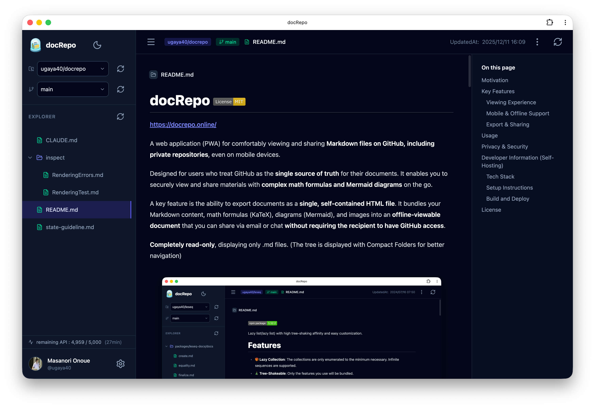

# docRepo [](LICENSE)


https://docrepo.online/

A web application (PWA) for comfortably viewing and sharing **Markdown files on GitHub, including private repositories**, even on mobile devices.

Designed for users who treat GitHub as the **single source of truth** for their documents. It enables you to securely view and share materials with **complex math formulas and Mermaid diagrams** on the go.

A key feature is the ability to export documents as a **single, self-contained HTML file**. It bundles your Markdown content, math formulas (KaTeX), diagrams (Mermaid), and images into an **offline-viewable document** that you can share via email or chat **without requiring the recipient to have GitHub access**.

**Completely read-only**, displaying only .md files. (The tree is displayed with Compact Folders for better navigation)



## Motivation

The official GitHub mobile app struggles with rendering LaTeX math formulas and Mermaid syntax.

Obsidian-like tools are not a good fit for my use case.[^obsidian]

Notion's export process is cumbersome, making it less ideal for iteratively refining ideas with AI assistants like ChatGPT or Gemini.

GitHub also offers the most convenient version history management.

docRepo was developed with the goal of treating GitHub as your document repository (Single Source of Truth), allowing you to **show documents to someone and discuss them** with the same rich rendering as on PC even when you're out, and to **share them securely on the spot**.

[^obsidian]: Obsidian is often described as a “second brain”, but I’m skeptical of that idea. When you have only a few notes, manually created links don’t add much value; when you have many notes, maintaining those links becomes painful and inevitably inaccurate. The number of potential link candidates grows as O(N²), which is basically **manual attention**.

## Key Features

### Viewing Experience
- **Advanced Markdown Rendering**:
  - **Math**: Fast formula rendering with KaTeX
  - **Diagrams**: Flowcharts, sequence diagrams, and more with Mermaid syntax
  - **Full GFM Support**: Tables, task lists, GitHub-specific alert syntax (Note, Warning, etc.)
  - **Syntax Highlighting**: Code highlighting for multiple languages
  - **Table of Contents**: Auto-generated handy Table of Contents
- **API Rate Limit Visibility**: Always see your remaining GitHub API calls.
- **Dark/Light Mode**: Follows your OS theme by default, with manual switching available.


### Mobile Support


- **PWA (Progressive Web App)**: Add to home screen and use like a native app
- **Smart Caching**: Repository structures and files are cached in IndexedDB upon viewing, enabling viewing while minimizing network access.

### Export & Sharing

- **Single HTML Export (Portable & Offline-viewable)**
  - Creates a single, standalone HTML file that works entirely offline. Perfect for sharing via email or chat, similar to a PDF.
  - **Zero External Dependencies**: Diagrams (Mermaid) are pre-rendered to SVG, and formulas (KaTeX) include embedded CSS and fonts—no network access required.
  - **Smart Image Embedding**: Images are automatically embedded into the HTML. This includes content from private GitHub repositories.
    - *Limitation*: Some external web images (e.g., badges) cannot be embedded due to browser security restrictions (CORS).
    - **Recommendation**: Store images for shared documents within your repository whenever possible. This helps ensure a fully self-contained HTML export that requires no network access.

- **Raw Markdown Download**
  - Download the original Markdown source file.

- **Print / PDF**
  - Printer-friendly styling produces clean PDFs, even from mobile browsers.
  - *iOS/iPadOS Tip*: Tap "Print" in the share sheet, then **pinch out (zoom in)** on the preview page to open and save it as a PDF.
  - *Note*: iOS Safari may display a warning about "automatic printing." This is expected behavior for print actions and is safe to proceed.


## Usage

Visit **[https://docrepo.online/](https://docrepo.online/)**

1. Click **Sign in with GitHub**
2. Authenticate with your GitHub account (requests read access to private repositories)
3. Select a repository and branch from the left sidebar
4. Select a Markdown file from the folder tree to view

## Privacy & Security

**The server only handles GitHub authentication.**

- **Data Storage**: Personal information including GitHub access tokens, repository files, and document contents are **never stored on our server**.
- **Communication**: All GitHub API communication is done directly from your browser (client-side).
- **Cache**: Cache data for performance is stored only in browser storage (IndexedDB/LocalStorage).
- **Authentication Info**: Only the GitHub user ID used for authentication is stored due to Supabase (auth infrastructure) system requirements.

---

## Developer Information (Self-Hosting)

A setup guide for those who want to host their own instance. As a static SPA (Single Page Application), it can be deployed to any hosting service such as Vercel, Cloudflare Pages, Netlify, GitHub Pages, etc.

### Tech Stack

- **Framework**: React 19 + TypeScript 5.9
- **Build Tool**: Vite (rolldown-vite)
- **Styling**: Tailwind CSS 4 + @tailwindcss/typography
- **State Management**: Zustand (with persistence)
- **Auth**: Supabase Auth (GitHub OAuth)
- **API**: Octokit
- **Markdown Stack**: react-markdown, remark-gfm, remark-math, remark-emoji, remark-github-blockquote-alert, rehype-raw, rehype-katex, rehype-highlight, rehype-slug
- **Diagram**: Mermaid.js
- **Icons**: lucide-react, @icons-pack/react-simple-icons
- **Toast**: sonner
- **Lightbox**: yet-another-react-lightbox
- **Cache**: idb-keyval (IndexedDB)
- **PWA**: vite-plugin-pwa

### Setup Instructions

#### 1. Clone Repository and Install Dependencies

```bash
git clone https://github.com/ugaya40/docrepo.git
cd docrepo
npm install
```

#### 2. Create Supabase Project

1. Create a new project at [Supabase](https://supabase.com/).
2. Go to **Authentication > Providers > GitHub** in the dashboard and enable "Enable GitHub".
   - Copy the `Callback URL` displayed here (e.g., `https://<project-ref>.supabase.co/auth/v1/callback`).

#### 3. Configure GitHub OAuth App

1. Go to [GitHub Developer Settings](https://github.com/settings/developers) > **OAuth Apps** > **New OAuth App**.
2. Configure as follows:
   - **Application name**: docRepo (or any name)
   - **Homepage URL**: `http://localhost:5173` (for development) or your production URL
   - **Authorization callback URL**: The Supabase Callback URL you copied earlier
3. After creation, obtain the **Client ID** and **Client Secret**.

#### 4. Configure Supabase Authentication

1. Return to the Supabase dashboard and enter the **Client ID** and **Client Secret** in the GitHub provider settings.
2. Add `repo read:user` to **Additional Scopes** (required for private repository access).
3. After saving, add the following to **Authentication > URL Configuration > Redirect URLs**:
   - `http://localhost:5173` (for local development)
   - `https://<your-deploy-url>` (for production)

#### 5. Set Environment Variables

Create `.env.local` in the project root and set the Supabase keys (available from Project Settings > API).

```env
VITE_SUPABASE_URL=https://<your-project>.supabase.co
VITE_SUPABASE_ANON_KEY=<your-anon-key>
```

#### 6. Start Development Server

```bash
npm run dev
```

### Build and Deploy

```bash
# Production build
npm run build

# Preview build
npm run preview
```

Deploy the generated `dist` directory to any static hosting service.

#### Notes for GitHub Pages Deployment

When deploying to a subdirectory like GitHub Pages (`https://<username>.github.io/docRepo/`), the following configuration changes are required:

1. **Base Path Configuration**
   Set the `VITE_BASE_PATH` environment variable when building.
   ```bash
   VITE_BASE_PATH=/docRepo/ npm run build
   ```
   (Or configure this variable in your CI/CD settings)

2. **Supabase Redirect Configuration**
   Add the public URL (e.g., `https://<username>.github.io/docRepo/`) to **Authentication > URL Configuration > Redirect URLs** in the Supabase dashboard.

## License

MIT
