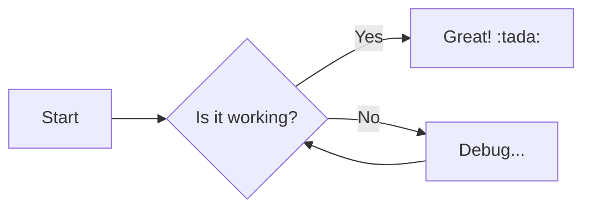
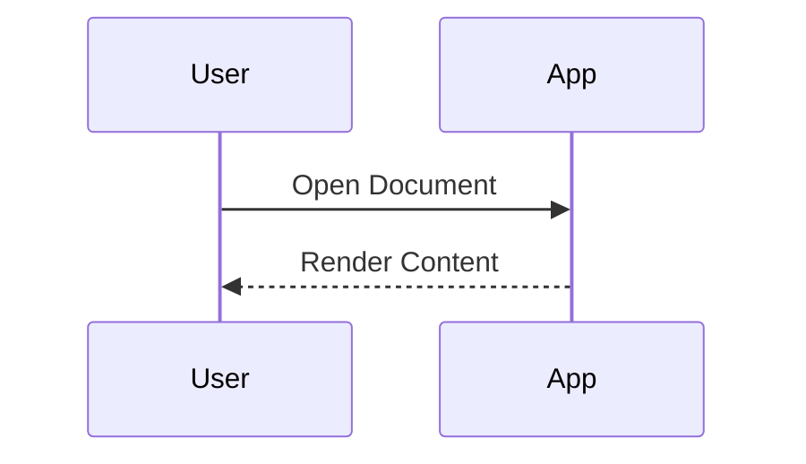
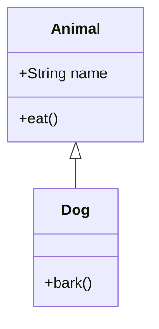

# docRepo Comprehensive Feature Test

This document is for testing all Markdown syntax, extensions, and rendering features supported by docRepo.

---

## 1. Standard Markdown & GFM

### Typography
- **Bold Text** and *Italic Text*
- ~~Strikethrough~~
- `Inline Code`
- [x] Task List Completed
- [ ] Task List Pending
- [Link Text](#)
- Auto link: https://github.com
    1. inner1
    2. inner2
        - nest1
        - nest 2

### Tables
| Left align | Center align | Right align |
| :--------- | :----------: | :---------- |
| Item 1     |    Value     |        $100 |
| Item 2     |    Value     |        $200 |

### Blockquote
> This is a standard blockquote.
> It can span multiple lines.

---

## 2. Syntax Highlighting

```typescript
// TypeScript Example
interface User {
  id: number;
  name: string;
}

const greet = (user: User) => {
  console.log(`Hello, ${user.name}!`);
};
```

```python
# Python Example
def factorial(n):
    if n == 0:
        return 1
    else:
        return n * factorial(n - 1)
```

---

## 3. Mathematical Formulas (KaTeX)

**Inline formula:**
Einstein's equation is $E = mc^2$.

**Display formula:**
$$
f(x) = \int_{-\infty}^\infty \hat f(\xi)\,e^{2\pi i \xi x} \,d\xi
$$

---

## 4. HTML Support (rehype-raw)

Testing layout adjustments using HTML tags.

<div align="center">
  <p>This text is centered using <code>&lt;div align="center"&gt;</code>.</p>
  <p><b>Bold text using HTML tags</b> also works.</p>
</div>

<details>
<summary>Click to expand (details/summary tags)</summary>
<br>
Hidden content is now displayed.
</details>

---

## 5. GitHub Alerts

> [!NOTE]
> **Note**: Supplementary information or context that users should be aware of.

> [!TIP]
> **Tip**: Advice or hints for better results.

> [!IMPORTANT]
> **Important**: Essential information for user success.

> [!WARNING]
> **Warning**: Content requiring attention or potential issues.

> [!CAUTION]
> **Caution**: Warning about dangerous operations that could lead to negative outcomes or data loss.

---

## 6. Mermaid Diagrams

### Flowchart (Left to Right)


### Sequence Diagram


### Class Diagram


---

## 7. Emoji Shortcodes

GitHub-style shortcodes are converted to emojis.

| Shortcode | Result | Shortcode | Result |
| :--- | :--- | :--- | :--- |
| `:smile:` | :smile: | `:rocket:` | :rocket: |
| `:tada:` | :tada: | `:warning:` | :warning: |
| `:+1:` | :+1: | `:heart:` | :heart: |
| `:fire:` | :fire: | `:checkered_flag:` | :checkered_flag: |

---

## 8. Relative Links & Images

### Images
Displays images using relative paths within the repository (only shown if the file exists).

Test for ``:


External image test:


### Links
Testing links within the repository.

- [Open README.md](../README.md)
